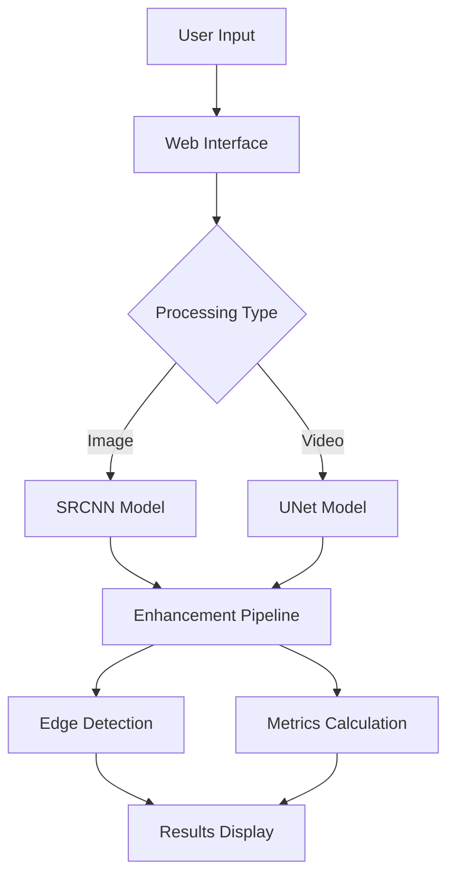

# Endoscopy Image Enhancement 🔬

[](https://opensource.org/licenses/MIT)
[](https://www.python.org/downloads/)
[](https://flask.palletsprojects.com/)
[](https://pytorch.org/)
[](https://opencv.org/)

> An advanced medical image enhancement web application leveraging deep learning models for improved diagnostic visualization.

<p align="center">
  
</p>

## 📋 Table of Contents
- [Overview](#overview)
- [Key Features](#key-features)
- [Technical Architecture](#technical-architecture)
- [Installation](#installation)
- [Usage Guide](#usage-guide)
- [Models](#models)
- [Performance Metrics](#performance-metrics)
- [Tech Stack](#tech-stack)
- [Contributors](#contributors)
- [License](#license)

## 🔭 Overview

This web application provides a state-of-the-art interface for enhancing medical endoscopy images using advanced AI models. It supports both image and video enhancement with real-time processing capabilities, making it valuable for medical professionals in diagnostic procedures.

## ⭐ Key Features

| Feature | Description |
|---------|------------|
| 🖼️ Image Enhancement | Real-time enhancement using SRCNN and UNet models |
| 🎯 Edge Detection | Advanced visualization of edges in original and enhanced images |
| 🎥 Video Processing | Support for video file processing and webcam integration |
| 📸 Frame Capture | Intelligent frame capture and enhancement from video streams |
| 📊 Analytics | Real-time PSNR and SSIM metrics visualization |

## 🏗️ Technical Architecture



## 🚀 Installation

```bash
# Clone the repository
git clone https://github.com/Kedhareswer/Endoscopy-Image-Enhancement.git
cd Endoscopy-Image-Enhancement

# Install dependencies
pip install -r requirements.txt

# Run the application
python app.py
```

## 📖 Usage Guide

### Image Enhancement
1. Navigate to the "Image Enhancement" tab
2. Upload an image (drag & drop or browse)
3. View enhanced results and metrics

### Video Enhancement
1. Access the "Video Enhancement" section
2. Choose video input source
3. Use controls for frame capture
4. Review enhanced frames

## 🧠 Models

### SRCNN (Super-Resolution CNN)
- Architecture: 3-layer CNN
- Activation: ReLU
- Purpose: Image super-resolution
- Input: Low-resolution medical images
- Output: Enhanced high-resolution images

### UNet
- Architecture: Encoder-decoder with skip connections
- Purpose: Biomedical image segmentation
- Speciality: Spatial information preservation
- Application: Real-time video enhancement

## 📊 Performance Metrics

| Metric | Description | Implementation |
|--------|-------------|----------------|
| PSNR | Peak Signal-to-Noise Ratio | Image quality assessment |
| SSIM | Structural Similarity Index | Structure preservation measurement |

## 🛠️ Tech Stack

| Category | Technologies |
|----------|-------------|
| Backend |   |
| Deep Learning |  |
| Image Processing |   |
| Frontend |   |

## 👥 Contributors

<table>
  <tr>
    <td align="center">
      <a href="https://github.com/Kedhareswer">
        
        <br />
        <sub><b>Kedhareswer</b></sub>
      </a>
    </td>
    <td align="center">
      <a href="https://github.com/jagadeshchilla">
        
        <br />
        <sub><b>Jagadesh Chilla</b></sub>
      </a>
    </td>
    <td align="center">
      <a href="https://linkedin.com/in/manish-chetla">
        
        <br />
        <sub><b>Manish Chetla</b></sub>
      </a>
    </td>
  </tr>
</table>

## 📄 License

This project is licensed under the MIT License - see the [LICENSE](LICENSE) file for details.

## 🙏 Acknowledgments

- SRCNN architecture: Chao Dong et al.
- UNet architecture: Olaf Ronneberger et al.
- Medical imaging community for valuable feedback

---
<p align="center">Made with ❤️ for better medical imaging</p>
